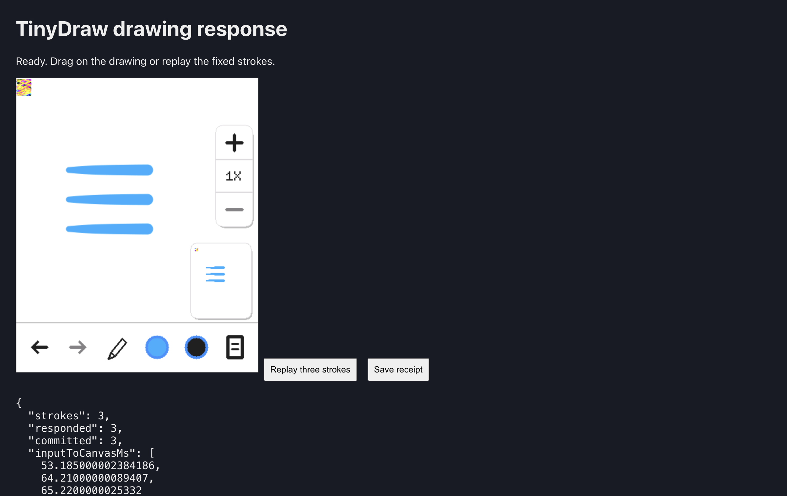

# TinyDraw browser CPU profile and drawing baseline

The first visible drawing replay exposed a display-model bug that the battery's
boolean gates did not detect. After fixing it, all three replayed strokes appeared
at their expected coordinates and firmware reported all three committed successfully.
Queued pen-down to changed pixels submitted to the canvas measured **53.2, 64.2 and
65.2 ms**. This is a three-stroke diagnostic baseline, not a percentile claim or
physical input-to-photon measurement.

## Display fix

ESP-IDF 6.0.2's LCD SPI driver sends a window command and its four coordinate bytes
in separate transfers. The CO5300 parser discarded a header-only `CASET` or `RASET`
command before its parameters arrived. Partial drawing updates therefore used the
previous window. The parser now preserves those pending commands; a regression
case covers split column and row commands, RAM write, and RAM-write continuation.
The existing combined-transfer cases remain covered.

The broken run still reported three successful firmware commits, but the screenshot
showed scattered pixels. Only one pen-down region changed, after 1.3 seconds; that
number is invalid as a drawing-latency measurement because the pixels were misplaced.
Compare [the broken image](broken-after.png) with the corrected image above. The small
multicolour patch at the upper left remains in the post-battery document; this test
establishes correct placement of the three new strokes, not a full framebuffer oracle.

The fixed run uses the production browser worker, including pacing and input delivery.
It boots the same September 4 TinyDraw build used for the battery, waits for the normal
app's READY line, then injects three horizontal strokes at y=140, 185 and 230. Each
holds pen-down at x=80 for 250 ms before moving to x=200 in eight steps, 100 ms apart.
Each measured first change occurred during the stationary hold. The measured region
is within 14 pixels of pen-down; the screen had been unchanged for at least one second
before each stroke. Input timestamps start immediately before posting touch input to
the worker. Browser pointer-event dispatch and physical screen scanout are excluded.

[The fixed receipt](fixed-response.json) retains inputs, frames and serial output;
[the input hashes](fixed-inputs.json) identify the firmware and simulator. Later tooling
adds first-move timing and restricts automatic replay to once per boot; those reporting
and UI changes were not present in this captured run. The three `authority_match=0`
fields are recorded at firmware lift, before its deferred canvas drain. Commit and
subsequent drain success are recorded, but this smoke test does not assert final
vector-authority equality.

## CPU profile

Both profiles use Chrome 152.0.7977.65 / V8 15.2.124.18 on the M1 Pro. They run the
unpaced battery in a dedicated worker, without canvas rendering. Both passed all 36
boolean gates with identical USB console output and 9,820,325,756 guest instructions.
The separate firmware `ssaa_receipt=yellow` status remains unresolved.

The ordinary build attributed 58.442 of 129.143 sampled seconds to `Machine::run`.
Rust and browser inlining place other execution work inside that function, so this
is not a measurement of pure scheduler cost.

A diagnostic `cpu-profile` feature preserves selected function boundaries at Rust
compilation without adding per-block clock calls. Its exclusive samples were:

| Location | Sampled seconds | Share |
| --- | ---: | ---: |
| Xtensa block dispatcher / interpreted block loop | 43.982 | 31.2% |
| Generated WASM blocks | 25.862 | 18.3% |
| Interpreter instruction execution | 17.974 | 12.7% |
| Machine block wrapper | 10.999 | 7.8% |
| PIE and selected 128-bit helpers | 6.520 | 4.6% |
| Other functions and idle time | 35.756 | 25.3% |

These categories are indicative: browser inlining can still move work across them.
The diagnostic also changes execution cost (139.83 seconds versus the ordinary
profiled run's 128.17 seconds). Neither duration is an uninstrumented optimization
comparison. Summaries weight samples by their `timeDeltas`, using node IDs rather
than array positions.

The profiles support a bounded experiment in reducing repeated block dispatch and
accounting. They do not establish how much a particular chaining design will save.
No connected-block execution was added in this change: the visible correctness defect
was fixed first so the new drawing benchmark can help judge the next JIT experiment.
Any chaining experiment must retain instruction budgets, timer boundaries, interrupts,
MMIO effects, code invalidation, observer stops and peer-core visibility. The timing
model remains instruction-count based; this work makes no hardware cycle-accuracy claim.

Raw profiles: [ordinary build](production.cpuprofile), [diagnostic boundaries](boundaries.cpuprofile).
Their result JSON, console events and textual summaries are archived alongside them.
Both CPU profiles preceded the display fix. The drawing receipt uses the rebuilt fixed
binary; [source hashes](source-sha256.json) identify the delivered Rust snapshot.

## Validation and reproduction

- 168 release workspace tests passed, including the golden-output suite and the new
  split-transfer regression.
- Ten AMOLED board tests passed.
- Native workspace Clippy and WASM Clippy with `cpu-profile` passed with warnings denied.
- Ordinary and diagnostic WASM builds completed.
- Both CPU-profile batteries passed all 36 gates; the corrected production-worker run
  also passed all 36 before entering interactive mode.
- Three input replays produced three visible strokes and three successful firmware commits.

The CPU captures ran without concurrent simulator runs or builds. Native checks ran
during some drawing-test boot time, and finished before the timed strokes; startup
throughput is not compared here. No device was connected or flashed.

Use [the browser benchmark instructions](../../../tools/browser-benchmark/README.md)
to serve the assets, capture CPU profiles or repeat the drawing interaction. All firmware
binaries remain local; the receipts identify them by hash.
